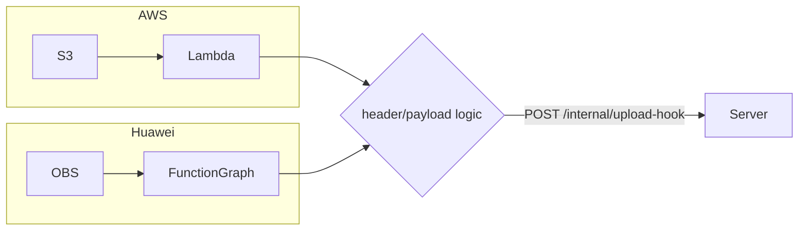

AWS 跟 Huawei Cloud 都有物件事件通知，兩朵雲上可以使用類似的服務來通知後端，讓後端做接下來業務邏輯。

<!--more-->

## 事件通知服務對照

| 項目      | AWS                                             | 華為雲              |
| --------- | ----------------------------------------------- | ------------------- |
| 物件儲存  | S3                                              | OBS                 |
| 訊息服務  | SNS                                             | SMN                 |
| HTTP 訂閱 | SNS HTTP/HTTPS subscription                     | SMN HTTP/HTTPS 訂閱 |
| 函數運算  | Lambda                                          | FunctionGraph       |
| 事件總線  | EventBridge（可用 API Destination 直接打 HTTP） | EventGrid（EG）     |

## 架構考量

如果後端有使用 SNS 的情況下，就會考慮使用 SNS 直接做接入。

但目前並沒有 SNS 的服務，所以考慮使用 Lambda 做 payload 加認證 header 往後端送資料。
這樣的好處是後端一套邏輯可以服務多套雲。



## AWS 實做

### Secrets Manager

建立一組 secrets object/upload/hook/hmac 做 HMAC 使用

```json
{"upload-hook/hmac":"Celsc27uXfSDwka2iK46hHizIYUPDtWF29aIEeudtC8wu58qISfGq3VyrKzPzrDp"}
```

### Lambda

要取得 secrets 需要加入 lambda 的權限

```json
{
  "Version": "2012-10-17",
  "Statement": [
    {
      "Effect": "Allow",
      "Action": "logs:CreateLogGroup",
      "Resource": "arn:aws:logs:us-east-1:123456789087:*"
    },
    {
      "Effect": "Allow",
      "Action": [
        "logs:CreateLogStream",
        "logs:PutLogEvents"
      ],
      "Resource": [
        "arn:aws:logs:us-east-1:123456789087:log-group:/aws/lambda/object-notification-upload-hook:*"
      ]
    },
    {
      "Effect": "Allow",
      "Action": "secretsmanager:GetSecretValue",
      "Resource": "arn:aws:secretsmanager:us-east-1:123456789087:secret:dev/object/upload/hook-*"
    }
  ]
}
```

程式碼

```python
import hashlib, hmac, json, os, time, urllib.parse, urllib.request
import boto3

HOOK_URL = os.environ["HOOK_URL"]
SECRET_ID = os.environ["SECRET_ID"]

_secret = None
def get_secret():
    global _secret
    if _secret is None:  # 快取，避免每次呼叫都讀 Secrets Manager
        sm = boto3.client("secretsmanager")
        _secret = sm.get_secret_value(SecretId=SECRET_ID)["SecretString"]
    return _secret

def lambda_handler(event, context):
    for r in event["Records"]:
        obj = r["s3"]["object"]
        bucket = r["s3"]["bucket"]["name"]
        key = urllib.parse.unquote_plus(obj["key"])  # key 是 URL encoded
        payload = {
            "eventName": r["eventName"],
            "provider": "aws",
            "region": r["awsRegion"],
            "bucket": bucket,
            "key": key,
            "size": obj.get("size"),
            "etag": obj.get("eTag"),
            "event_time": r["eventTime"],
            "event_id": hashlib.sha256(
                f'{bucket}/{key}/{obj.get("sequencer", "")}'.encode()
            ).hexdigest(),
        }
        body = json.dumps(payload, separators=(",", ":")).encode()
        ts = str(int(time.time()))
        sig = hmac.new(get_secret().encode(),
                       ts.encode() + b"." + body,
                       hashlib.sha256).hexdigest()
        req = urllib.request.Request(
            HOOK_URL, data=body, method="POST",
            headers={"Content-Type": "application/json",
                     "X-Timestamp": ts,
                     "X-Signature": f"sha256={sig}"},
        )
        with urllib.request.urlopen(req, timeout=5) as resp:
            if resp.status >= 300:
                raise RuntimeError(f"hook failed: {resp.status}")
```

### S3

1. 建立設定 Event notifications

2. S3 事件通知的資料結構:

```json
{
  "Records": [
    {
      "eventVersion": "2.0",
      "eventSource": "aws:s3",
      "awsRegion": "us-east-1",
      "eventTime": "1970-01-01T00:00:00.000Z",
      "eventName": "ObjectCreated:Put",
      "userIdentity": {
        "principalId": "EXAMPLE"
      },
      "requestParameters": {
        "sourceIPAddress": "127.0.0.1"
      },
      "responseElements": {
        "x-amz-request-id": "EXAMPLE123456789",
        "x-amz-id-2": "EXAMPLE123/5678abcdefghijklambdaisawesome/mnopqrstuvwxyzABCDEFGH"
      },
      "s3": {
        "s3SchemaVersion": "1.0",
        "configurationId": "testConfigRule",
        "bucket": {
          "name": "example-bucket",
          "ownerIdentity": {
            "principalId": "EXAMPLE"
          },
          "arn": "arn:aws:s3:::example-bucket"
        },
        "object": {
          "key": "test%2Fkey",
          "size": 1024,
          "eTag": "0123456789abcdef0123456789abcdef",
          "sequencer": "0A1B2C3D4E5F678901"
        }
      }
    }
  ]
}
```

### 後端服務 log

```http
## Header
INFO:root:POST request,
Path: /
Headers:
Host: test-server.example.com
X-Request-ID: c43aa38838002609c38669e7c11ff164
X-Real-IP: 107.23.59.222
X-Forwarded-For: 107.23.59.222
X-Forwarded-Host: test-server.example.com
X-Forwarded-Port: 80
X-Forwarded-Proto: http
X-Forwarded-Scheme: http
X-Scheme: http
Content-Length: 286
Accept-Encoding: identity
User-Agent: Python-urllib/3.14
Content-Type: application/json
X-Timestamp: 1790751958
X-Signature: sha256=2b0e2c1d2309decc6f3bae2657226d23b9227cd0e985ecfdb40d6d5f0fe2464a

## Body
{"eventName":"ObjectCreated:Put","provider":"aws","region":"us-east-1","bucket":"example-bucket","key":"test/key","size":1024,"etag":"0123456789abcdef0123456789abcdef","event_time":"1970-01-01T00:00:00.000Z","event_id":"83225672c31de8f59b15949bf248a6d04cc3173f43bfdf1d93f23345e00591e9"}

## Response
10.2.3.208 - - [30/Sep/2026 07:05:58] "POST / HTTP/1.1" 200 -
```

## Huawei 實做

### FunctionGraph

在設置中配置環境變數 HMAC_SECRET 做 HMAC 使用，加密参数要開啟。

```
HMAC_SECRET={"upload-hook/hmac":"Celsc27uXfSDwka2iK46hHizIYUPDtWF29aIEeudtC8wu58qISfGq3VyrKzPzrDp"}
```

程式碼

```python
import hashlib, hmac, json, time, urllib.parse, urllib.request

def handler(event, context):
    hook_url = context.getUserData("HOOK_URL")
    secret = context.getUserData("HMAC_SECRET").encode()

    data = event["data"]
    records = data if isinstance(data, list) else [data]

    for r in records:
        obs = r["obs"]
        obj = obs["object"]
        bucket = obs["bucket"]["bucket"]
        key = urllib.parse.unquote_plus(obj["key"])
        payload = {
            "eventName": r["eventName"],
            "provider": "huawei",
            "region": r["eventRegion"],
            "bucket": bucket,
            "key": key,
            "size": obj.get("size"),
            "etag": obj.get("eTag"),
            "event_time": event["time"],
            "event_id": hashlib.sha256(
                f'{bucket}/{key}/{obj.get("sequencer") or obj.get("eTag", "")}'.encode()
            ).hexdigest(),
        }
        body = json.dumps(payload, separators=(",", ":")).encode()
        ts = str(int(time.time()))
        sig = hmac.new(secret, ts.encode() + b"." + body, hashlib.sha256).hexdigest()
        req = urllib.request.Request(
            hook_url, data=body, method="POST",
            headers={"Content-Type": "application/json",
                     "X-Timestamp": ts,
                     "X-Signature": f"sha256={sig}"},
        )
        with urllib.request.urlopen(req, timeout=5) as resp:
            if resp.status >= 300:
                raise RuntimeError(f"hook failed: {resp.status}")
```

### OBS

1. 建立事件通知 > EG 通知

2. OBS 事件通知的資料結構:

```json
{
  "datacontenttype": "application/json",
  "data": {
    "obs": {
      "bucket": {
        "bucket": "developer-test-example",
        "name": "developer-test-example",
        "arn": "",
        "ownerIdentity": {
          "ID": "28a7528d52e5417cb9a0ac2dbb59ea05"
        }
      },
      "Version": "1.0",
      "configurationId": "5d1b530b-be59-4fdc-adf7-f808cf06f8c9",
      "object": {
        "versionId": "G00101A0F057D2A5FFFFCB8700806592null",
        "oldpsxpth": "",
        "size": 112,
        "eTag": "6f9433fb110632de417e2e697dcb1b5f",
        "key": "test.tar",
        "sequencer": "1"
      }
    },
    "eventVersion": "3.0",
    "responseElements": {
      "x-obs-id-2": "",
      "x-obs-request-id": "b27e6cbff1f6865c83111f130a982f56",
      "x-amz-request-id": "",
      "x-amz-id-2": ""
    },
    "eventSource": "OBS",
    "eventTime": "2026-09-30T11:24:42.533Z",
    "requestParameters": {
      "sourceIPAddress": "10.147.244.52"
    },
    "eventName": "ObjectCreated:Put",
    "eventRegion": "cn-east-3",
    "userIdentity": {
      "ID": "28a7528d52e5417cb9a0ac2dbb59ea05"
    }
  },
  "subject": "test.tar",
  "specversion": "1.0",
  "id": "b27e6cbff1f6865c83111f130a982f56",
  "source": "HC.OBS.DWR",
  "time": "2026-09-30T03:24:43.167931174Z",
  "type": "OBS:DWR:ObjectCreated:PUT",
  "ttl": "4000",
  "dataschema": ""
}
```

### 後端服務 log

```http
## Header
INFO:root:POST request,
Path: /
Headers:
Host: test-server.example.com
X-Request-ID: ab97ce131762e36eddb0bb84f9a0224a
X-Real-IP: 124.70.188.94
X-Forwarded-For: 124.70.188.94
X-Forwarded-Host: test-server.example.com
X-Forwarded-Port: 80
X-Forwarded-Proto: http
X-Forwarded-Scheme: http
X-Scheme: http
Content-Length: 302
Accept-Encoding: identity
User-Agent: Python-urllib/3.9
Content-Type: application/json
X-Timestamp: 1790752223
X-Signature: sha256=be7f7e2a0110f892623df4eb5527e39fb75fa60c40a90c3a0ea24c38f3f8d478

## Body
{"eventName":"ObjectCreated:Put","provider":"huawei","region":"cn-east-3","bucket":"developer-test-example","key":"test.tar","size":112,"etag":"6f9433fb110632de417e2e697dcb1b5f","event_time":"2026-09-30T03:24:43.167931174Z","event_id":"3cd62445e85a61e5063d28596bd07b37b0a66bc2c2202da5cf049988c9c9caa2"}

## Response
10.2.1.158 - - [30/Sep/2026 07:10:23] "POST / HTTP/1.1" 200 -
```
