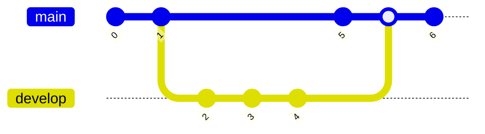
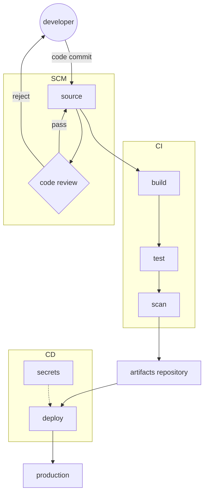
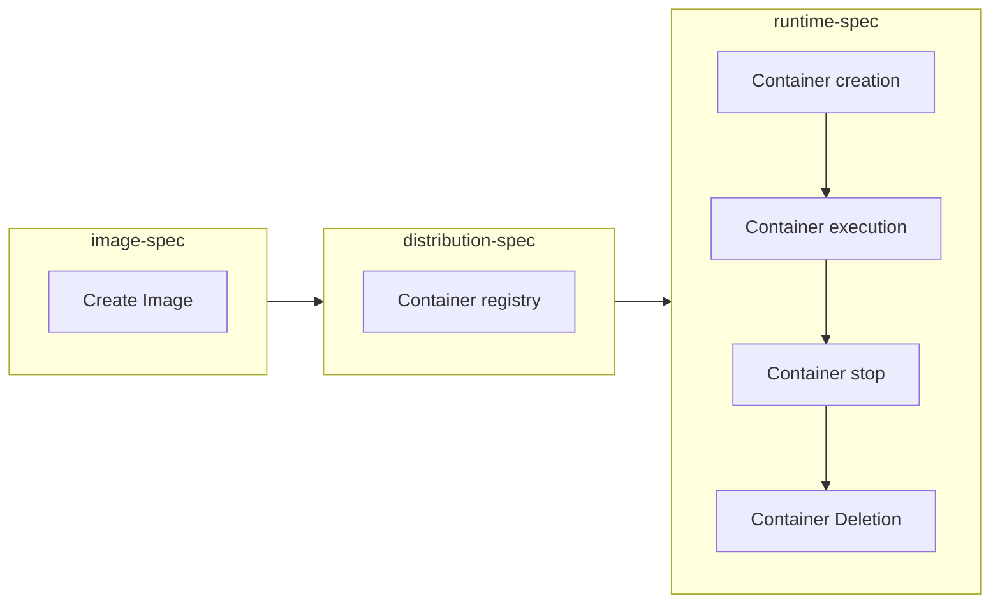

### Evergreen Note

Question :: 為什麼要做 DevOps 面試問題?

Answer :: 定期更新與準備 DevOps 面試問題, 可有助於面試人或者被面試的能力.

<!--more-->

#### 流程構思

假設筆試做題時間 30 分鐘的話, 可以抽個 6 ~ 10 題（每題作答時間約 3~5 分鐘）。 個人習慣抽一個做不完的數量，一來可以評估程度；二來可以評估如何應對做不完的考題。

#### 筆試

1. 請簡述 DevOps 的核心原則和目標是什麼？

	DevOps 是增強開發(DEV)和運營(OPS)之間的協作和整合之文化，解決傳統兩個團隊之間的隔閡和摩擦，將問題以軟體工程的方式處理實現更快速、更穩定的交付流程。其目標為：`協作和整合`、`持續整合與持續交付`、`自動化`、`可靠性和穩定性`、`文化轉變`、`迭代和持續改進`

2. 什麼是版本控制？版本控制在 DevOps 中有什麼作用？

	軟體工程上的版本控制，是軟體開發過程中程式碼管理和追蹤的方法。它允許團隊在多人協作的情況下，確保團隊成員能夠同時進行軟體開發，而不會干擾彼此的工作，且幫助開發人員追蹤程式碼的變更歷史。
	
	版本控制在 DevOps 中是重要功能之一，可以幫助開發團隊更好地管理程式碼，提高協作效率，確保代碼的品質。在自動化部署流程中，可以使用版本控制系統中的特定標籤或分支，確保在不同環境中部署一致的程式碼，使系統有更好的可靠性和穩定性。

3. 請簡述如何管理版本控制的衝突（conflict）和合併（merge）。
   
   版本控制的衝突和合併是在多人協作開發的過程中常見的任務，目的是為了確保程式碼的一致性。其管理流程為：

	1. 創建分支
	2. 提交變更
	3. 拉取main -> 解決衝突
	4. 提交衝突變更 -> 進行合併
  

   
4. 請解釋容器化技術中的 uid、gid 與宿主機的關係為何？

	Linux 中使用 uid 與 gid 作為使用者和群組的唯一識別碼。在容器中進程的 uid 和gid 通常是在創建容器映像時所定義，以實現隔離和安全性。
	
	容器映像中可以包含使用者和群組配置，以及對應的uid和gid。當容器運行時，容器運行時環境會使用這些設定來創建容器內的使用者和群組。但如果容器中進程的 uid 和 gid 與宿主機上的 uid 和 gid 相同，可能會導致安全性問題，

5. 請簡述 Docker 和 Kubernetes 之間的關係，以及它們分別用於什麼？

	Docker 為容器化技術之一，用以封裝應用程序和其相關的依賴套件，創建獨立的且可移植的運行環境。Kubernetes 是一個開源的容器管理平台，用於自動化容器的部署、維護、擴展和調度。它可以管理大規模的容器集群，確保應用程序的高可用性、自動擴展和動態調整。

	Docker 與 Kubernetes 的關係為容器封裝與容器管理，確保應用程序可以在不同的運行環境中實現高可用性和彈性的部署。

6. 請依據您個人的經驗設計 CI/CD 流程，並請說明使用到的工具及目的？

	1. 提交程式碼，可使用 Git、SVN
	2. 程式碼審核，可使用 GitHub、GitLab
	3. 執行編譯產出結果，例如 JAR、Image、static file，可使用 Docker、Podman 容器技術產生映像檔
	4. 單元測試、整合測試，可使用 Cucumber、SoapUI
	5. 程式漏洞掃描，可使用 SonarQube、Trivy
	6. 產出物存儲庫，可使用 Sonatype Nexus、Harbor
	7. 部署執行工具，可使用 Jenkins、Drone、Ansible
	8. 機敏資訊管理，可使用 HashiCrop vault
	9. 運行環境，可使用  Kubernetes

7. 您如何確保在不同環境中的一致性，例如開發、測試和生產環境？

	基礎建設的部分可以使用基礎設施即代碼工具，例如 Terraform、Ansible 等，使各個環境的架構相同；而服務運行的程式部分則可以透過容器化技術建立可移植的映像檔案，讓映像檔有可複使用之特性，利於部署到不同環境上。當環境架構相同與服務程式的可移植特型就可以確保各環境的狀態一致。

	當部署完成後，各環境可能會因為不同的壓力負荷導致系統異常。所以可在各環境中實施監控和追蹤，以便及時發現並解決問題，確保系統的健康運行。
	
8. 說明你在雲端平台上的經驗（AWS、Azure 或 Google Cloud），例如資源管理、自動縮放和成本優化。

	我擁有豐富的資源管理、自動縮放和成本優化經驗，透過 Infrastructure as Code 建置雲上的各個資源。並且確保在雲端平台上實施最佳的安全性，包括設定安全組、IAM 角色和權限，並遵循適用的合規性要求。

	再者使用雲平台的 Kubernetes 技術，例如 AWS 的 EKS、GCP 的 GKE 作為容器管理工具。由 Kubernets 的 Horizontal Pod Autoscaling  功能與雲平台的 Autoscaling 功能做搭配，達到依據負載量做自動調整資源，可以有效的優化成本，來依據服務負載量來做資源調度。

9. 什麼是基礎設施即代碼（Infrastructure as Code，IaC）？有使用過哪些 IaC 工具？

	基礎設施即代碼（Infrastructure as Code，IaC）是通過程式碼的方式進行描述來
	管理與操作基礎設施的配置，來實現自動化的基礎設施部署、管理和變更。我目前使用過的 IaC 工具有 Terraform、Terragrun 用來管理雲平台資源，並使用 Ansible 做組態配置管理。

10. 請問如何檢測 DNS Server 解析正常？

	要檢測 DNS Server 的狀況可以使用 nslookup、dig 命令來查詢特定域名的解析結果。

11. 你有使用過哪些自動化工具，例如 Ansible、Chef 或 Puppet？請舉例說明你如何使用它們。

	我擁有豐富的 Ansible 工具使用經驗，透過 Ansible 執行自動化任務，例如：實例的組態配置與權限配置、執行自動部署、操作防火牆設定、架設 web server 等。並且搭配 Ansible AWX 介面，可以綁定角色權限執行任務的調度，也可做稽核審查。
	
12. 如何監控和管理應用程式的運行狀況？你使用過哪些監控工具？

	基於 Kubernetes 架構上，可以透過探針 (Probes) 來確認應用程式的運行狀態。為了可以保存週期性的資料，使用了 Prometheus 用於多維度數據收集和警報，並採用可視化監控數據工具 Grafana 做數據整理與分析，將結果產生成儀表板，進而達到監控和管理應用程式的運行狀況。
	
13. 你在監控和日誌分析方面使用過哪些工具？如何確保及時發現問題並進行故障排除？

	基於 Kubernetes 架構上，建置了 Fluent Bit 作為日誌搜集與過濾之工具，並將其結果儲存在 AWS CloudWatch 上的 Log Stream 中，最後使用數據可視化和監控工具 Grafana 創建圖表和儀表板。

	基於上述的日誌系統架構，可以設定告警規則、實時監控、日誌分析和查找等，綜合使用這些方法，可以在及早發現問題並快速進行故障排除方面實現更好的效果。

14. 你在持續備份和數據恢復方面的經驗是什麼？請描述你的方法和工具。

	收先要先確認備份資源是什麼，這邊假設以 AWS RDS 為例子，RDS 服務有提供多種備份機制，我過往的經驗是採用快照備份，快照是一個靈活的備份方式，它可以保存 RDS 實例的當前狀態，包括數據庫、日誌和配置等。

	RDS 快照保存為 1 天 1 次，所以還是有可能造成 24 小時內的資料遺失。為了解決資料遺失區間過大，所以也導入了增量備份的策略。我採用的增量備份策略是備份一定時間內的 Binary Logs，並設定自動化備份流程執行定期備份，使資料遺失的區間減少。

	當 RDS 毀損時，即可以使用 "快照" 與 "Binary Logs" 做數據恢復，盡可能做到資料回復。資料回損已經是很嚴重的災情，為了避免到這一步，通常也會把系統設計為高可用性架構。

15. 請簡述 Container 的生命週期 (基於 OCI 標準)？

	基於 OCI (Open Container Initiative) 標準，容器的生命週期可以簡述如下:
	
	1. Image 準備階段：這個階段包括 Dockerfile 或其他容器設定檔的編寫，來定義映像檔，然後使用 Docker 或其他容器引擎來建立 Image。
	2. Container 建立階段：這個階段為運行容器引擎命令，並指示引擎使用指定的 Image 和配置來啟動容器。
	3. Container 執行階段： 在此階段，容器內運行的應用程式開始處於運行狀態，並根據設定執行所需的工作。
	4. Container 停止階段： 當應用程式完成其工作，或者其他原因來停止容器。停止後，容器不再執行應用程式並且可以從系統中移除。
	5. Container 刪除階段： 容器停止後，可以從系統中刪除容器實例。刪除容器將釋放系統資源，並清理容器的臨時數據等。

#### 面談

1. 如何處理服務的擴展和負載均衡？
2. 如何管理機密資料和敏感設定，例如密碼和 API 金鑰？
3. 你如何確保應用程式和基礎設施的安全性？有哪些安全實踐？
4. 如何優化應用程式和基礎設施的性能？
5. 你有使用過 Configuration Management 工具嗎？請舉例說明。
6. 什麼是微服務架構，你認為它有哪些優勢和挑戰？
7. 解釋 CI/CD 的概念以及它如何有助於軟體交付流程。
8. 什麼是 Kubernetes？請說明它的主要功能和優點。
9. 談談你如何確保基礎設施的高可用性和彈性。
10. 如何在高可用性環境中設計和部署應用程式？依據你過往的經驗說明。
11. 請描述一個你曾經處理過的緊急系統故障的經驗，以及你是如何排除。
12. 談談容錯和災難恢復（Disaster Recovery）的策略，以及你如何確保系統的高可用性和故障容忍性。
13. 解釋軟體部署的藍綠部署（Blue-Green Deployment）和金絲雀部署（Canary Deployment），以及它們的優點和用途。
14. 請談談你如何監控和管理日誌（log），以確保系統的可追蹤性和故障排查。
15. 最近你學習或採用的新技術、工具或實踐是什麼？請講述你學習和應用它們的經驗。
16. 在你的過去經驗中，你覺得自己在哪些方面最具有優勢，可以為團隊帶來最大的價值？

#### 程度較佳, 可詢問

1. 請解釋一下軟件定義網絡（SDN）在 DevOps 中的應用。
2. 你如何處理系統中的數據安全和隱私問題？
3. 如何進行流量規劃，確保系統在負載高峰期仍然可用？
4. 解釋一下無服務區（Dark Launch）的概念，以及在實際應用中的優勢。
5. 你曾經遇到過一個數據庫性能下降的情況，你會如何診斷和解決這個問題？
6. 如果你需要設計一個分佈式系統的負載均衡策略，你會考慮哪些因素？
7. 你如何處理分佈式系統中的一致性和異常情況？
8. 你如何測試和確保新的代碼變更不會影響現有系統的穩定性？
9. 如果系統的壓力測試顯示出性能問題，你會如何分析並解決這些問題？
10. 請描述你如何設計和實現自動化的故障回滾（Rollback）策略。
