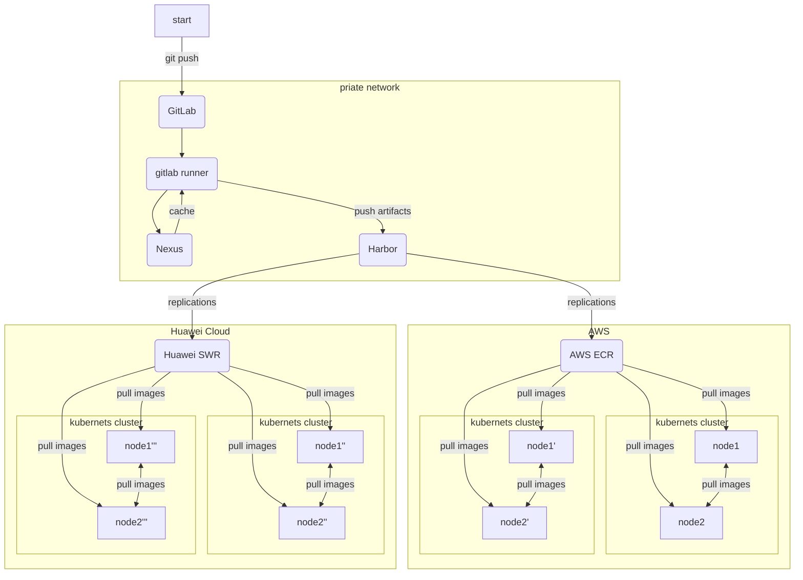

Kraken 是一個使用 P2P 技術的容器映像檔推拉服務，適合在分散式架構下使用。官方測試 Kraken distributes 20K 100MB-1G blobs in under 30 sec。

<!--more-->

### Refencers

1. [Github](https://github.com/uber/kraken)

> Kraken has been in production at Uber since early 2018. In our busiest cluster, Kraken distributes more than 1 million blobs per day, including 100k 1G+ blobs. At its peak production load, Kraken distributes 20K 100MB-1G blobs in under 30 sec.

### 使用情境

要在跨雲環境中使用Kraken，我們需要考慮幾個關鍵點：

1. 網絡連接：
   - 確保不同雲環境之間有穩定的網絡連接。這可能需要設置VPN或直接連接服務（如AWS Direct Connect或Azure ExpressRoute）。
   - 配置防火牆規則，允許Kraken組件之間的通信。

2. 中央協調：
   - 在一個中心位置部署Tracker組件。這可以是任何一個雲環境，或者是一個中立的位置。
   - Tracker需要能夠與所有雲環境中的Agent和Origin通信。

3. 存儲配置：
   - 利用Kraken的可插拔存儲特性。在每個雲環境中配置適當的存儲後端（例如，在AWS中使用S3，在Azure中使用Blob Storage）。
   - 確保Origin組件可以訪問這些存儲後端。

4. Agent部署：
   - 在每個雲環境的所有主機上部署Agent。
   - 配置Agent使其能夠與中央Tracker通信。

5. 跨雲複製：
   - 利用Kraken的跨集群複製功能。設置規則，以確保重要的映像在不同的雲環境之間同步。
   - 這可以通過Build-Index組件來管理。

6. 負載均衡：
   - 在每個雲環境中部署Proxy組件。
   - 使用雲提供商的負載均衡服務來分配對Proxy的請求。

7. DNS配置：
   - 設置DNS以便各個組件可以相互發現。這可能需要使用跨雲DNS解決方案。

8. 監控和日誌：
   - 實施跨雲監控解決方案，以便您可以監視所有環境中的Kraken性能。
   - 集中日誌收集，以便於故障排除。

9. 安全性：
   - 實施端到端加密，特別是對於跨雲通信。
   - 使用雲提供商的身份和訪問管理服務來控制對Kraken組件的訪問。

10. 災難恢復：
    - 在不同的雲環境中設置備份和故障轉移機制。

### devcluster

在專案下有提供測試使用的環境 devcluster，可以執行命令啟動服務。

```bash
make images # 編譯所有組建映像檔
make devcluster # 本地運行測試
```

在容器內 agent 的執行命令

```bash
# kraken-agent-one
/usr/bin/kraken-agent --config=/etc/kraken/config/agent/development.yaml --peer-ip=host.docker.internal --peer-port=16001 --agent-server-port=16002 --agent-registry-port=16000

# kraken-agent-two
/usr/bin/kraken-agent --config=/etc/kraken/config/agent/development.yaml --peer-ip=host.docker.internal --peer-port=17001 --agent-server-port=17002 --agent-registry-port=17000
```

在容器內  testfs 的執行命令

```bash
/usr/bin/kraken-testfs --port=14000
```

在容器內  origin 的執行命令

```bash
/usr/bin/kraken-origin --config=/etc/kraken/config/origin/development.yaml --blobserver-hostname=host.docker.internal --blobserver-port=15002 --peer-ip=host.docker.internal --peer-port=15001
```

在容器內  tracker 的執行命令

```bash
/usr/bin/kraken-tracker --config=/etc/kraken/config/tracker/development.yaml --port=15003
```

在容器內  build-index 的執行命令

```bash
/usr/bin/kraken-build-index --config=/etc/kraken/config/build-index/development.yaml --port=15004
```

在容器內  proxy 的執行命令

```bash
/usr/bin/kraken-proxy --config=/etc/kraken/config/proxy/development.yaml --port=15000 --server-port=15005
```

### 相依性：

- agent: build-index、tracker
- origin: origin、testfs
- build-index: origin、build-index、testfs
- testfs:
- tracker: origin
- proxy: origin、build-index

### 安裝步驟：

1. testfs：testfs是Kraken的測試檔案系統組件，主要用於測試環境中模擬儲存層。
2. origin：origin是Kraken的核心儲存組件，作為整個分發系統的源頭，可以從上游 registry 拉取映像。
3. build-index：build-index組件負責索引和管理映像與標籤的關係。
4. proxy：proxy組件是Docker客戶端的接入點。
5. tracker：tracker是P2P分發網路的協調者。
6. agent：agent運行在每個需要Docker映像的主機上。

其中 push 需要服務 1、2、3、4
其中 pull 需要服務 1、2、3、4、5、6

### 整合結構

- 優點：
  1. 可以從其他 node 上獲取 images，減少 registry 的壓力
  2. 拉取映像檔案效率較高
  3. 隱匿映像檔來源

- 缺點：
  1. 需要多建立 daemonset 服務，佔用主機資源

