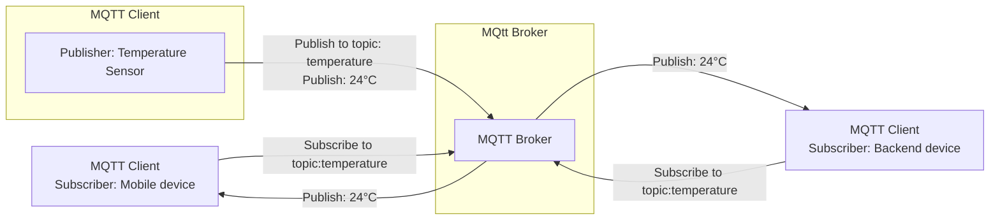

### Evergreen Note

Question :: 這篇文章主要在說什麼?

Answer :: 初探 MQTT 的協議與使用目的，了解 MQTT 的特色。

<!--more-->

### Summary

MQTT 是設計給 IoT 作為訊息傳遞來使用的協定。通常 IoT 硬件通常會有資源上的限制，所以 MQTT 的特色就是輕量且高效。
下面列出了 MQTT 的特色：

1. Lightweight and Efficient（輕量且高效）
2. Bi-directional Communications（裝置跟服務可雙向溝通）
3. Scale to Millions of Things（可平行擴充）
4. Reliable Message Delivery（可靠的訊息傳遞）
5. Support for Unreliable Networks（適用於網路不穩定的環境之下）
6. Security Enabled  （安全性，可使用 TLS 加密訊息）

#### 下圖為 MQTT org 上的 Publish / Subscribe 架構，也繪出一份 flowchart 供紀錄。

*MQTT pub/sub Flowchart*

### Note

原文 :: [mqtt org](https://mqtt.org/)

#### MQTT: The Standard for IoT Messaging

MQTT is an OASIS standard messaging protocol for the Internet of Things (IoT). It is designed as an extremely lightweight publish/subscribe messaging transport that is ideal for connecting remote devices with a small code footprint and minimal network bandwidth. MQTT today is used in a wide variety of industries, such as automotive, manufacturing, telecommunications, oil and gas, etc.

#### Why MQTT?

- *Lightweight and Efficient*

   MQTT clients are very small, require minimal resources so can be used on small microcontrollers. MQTT message headers are small to optimize network bandwidth.

- *Bi-directional Communications*

   MQTT allows for messaging between device to cloud and cloud to device. This makes for easy broadcasting messages to groups of things.

- *Scale to Millions of Things*

   MQTT can scale to connect with millions of IoT devices.

- *Reliable Message Delivery*

   Reliability of message delivery is important for many IoT use cases. This is why MQTT has 3 defined quality of service levels: 0 - at most once, 1- at least once, 2 - exactly once

- *Support for Unreliable Networks*

   Many IoT devices connect over unreliable cellular networks. MQTT’s support for persistent sessions reduces the time to reconnect the client with the broker.

- *Security Enabled*

   MQTT makes it easy to encrypt messages using TLS and authenticate clients using modern authentication protocols, such as OAuth.

#### MQTT Publish / Subscribe Architecture

*MQTT publish subscribe image*

#### Is MQTT a standard?

v5.0 and v3.1.1 are now OASIS standards (v3.1.1 has also been ratified by ISO).

