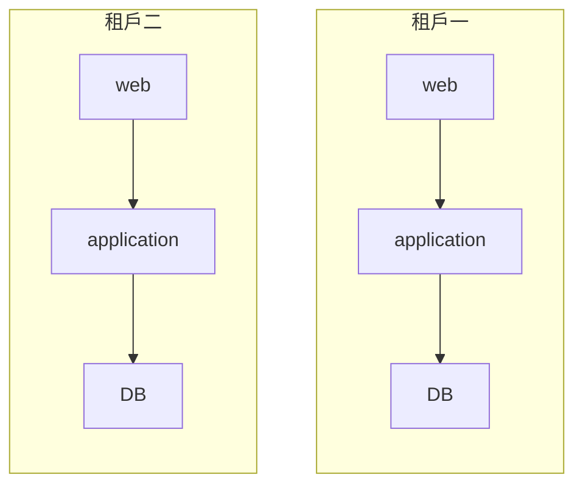
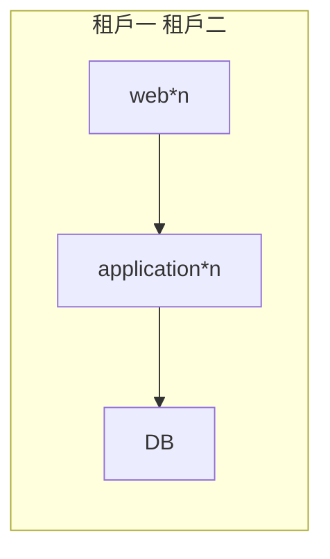
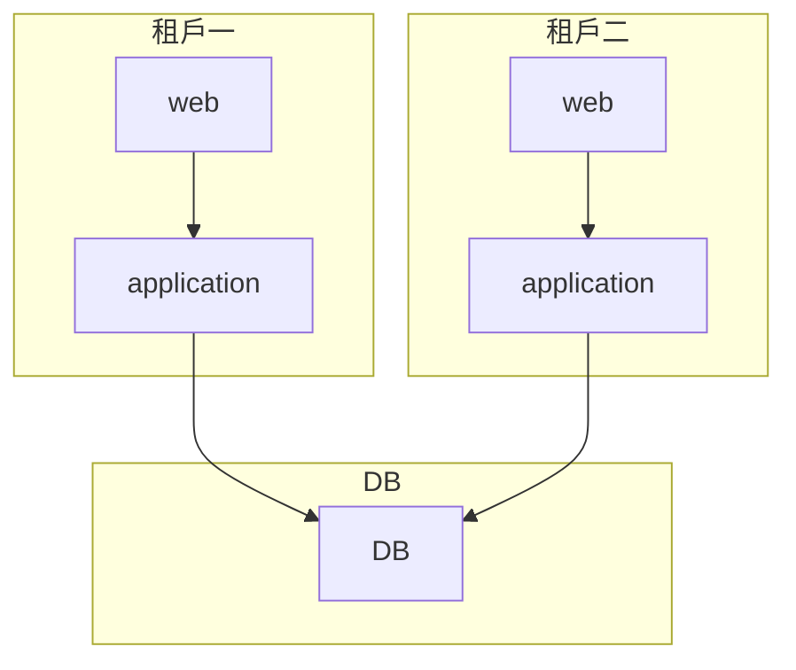
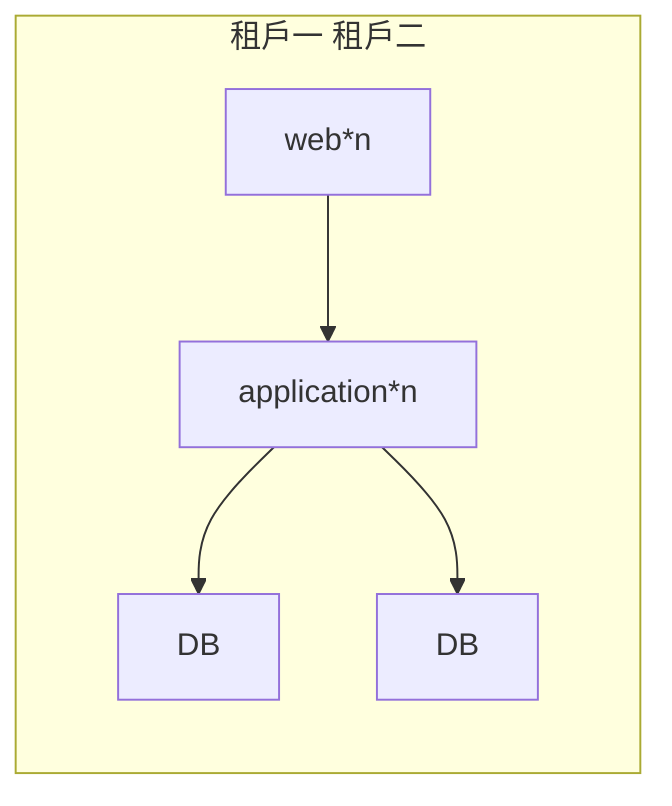
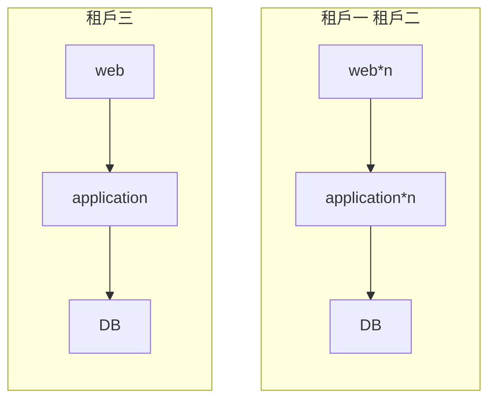

[阿里雲文章](https://developer.aliyun.com/article/1142510?spm=5176.26934562.main.11.5a37510bSLvY8d)，說明多種多租戶架構的方式

#### 獨享資源模式

每個租入的 web、application、database 各自獨立。
用戶完全隔離，優點是用戶不互相影響、資料完全隔離，缺點是硬體成本較高

#### 共享資源池租戶模式

1. 全共享模式

2. 數據層共享模式

3. 租戶應用環境共享模式

#### 混合租戶模式

